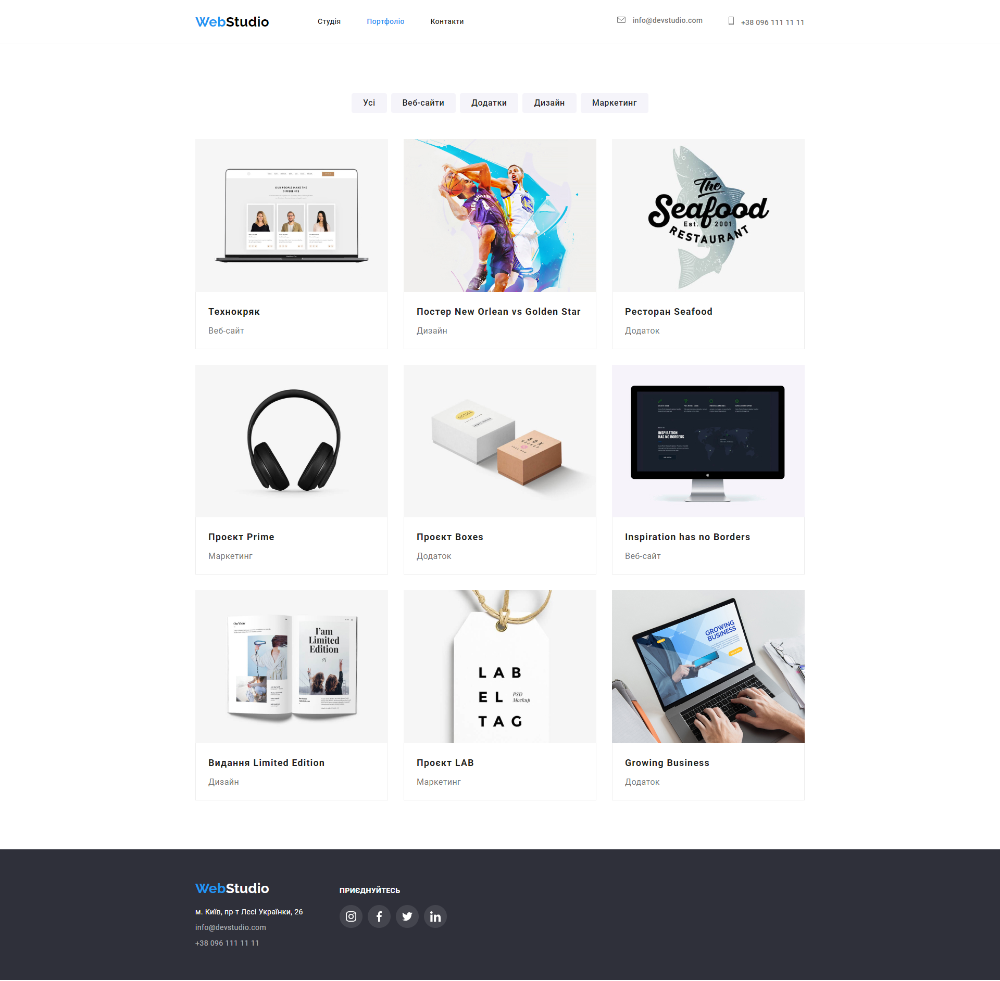

# WebStudio website

## Homework#04

Add marking and design of icons and decorative effects for pages from the
[Layout markup](<https://www.figma.com/file/3lQQ9l3yQYngZaAsfPkRSL/Web-Studio-(Version-2.1)-(Copy)?node-id=1%3A95&mode=dev>).
The [Icomoon](https://icomoon.io/) service was used to generate the SVG sprite. The
[svgomg](https://jakearchibald.github.io/svgomg/) service was used to optimize the created SVG
sprite. Configured GitHub Pages and added a
[link](https://valerii2022.github.io/goit-markup-hw-04-FSON/) to the live page in the
GitHub-repository header.

### [Main Page](https://valerii2022.github.io/goit-markup-hw-04-FSON/)

### [Portfolio Page](https://valerii2022.github.io/goit-markup-hw-04-FSON/portfolio.html)

